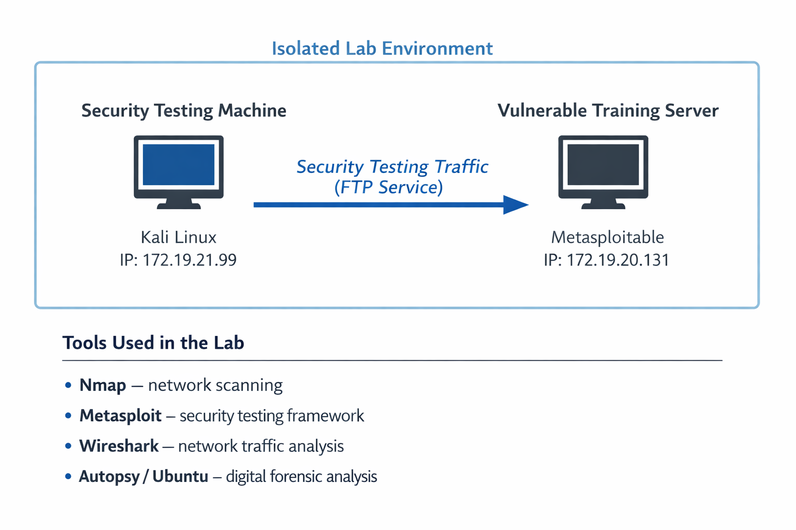
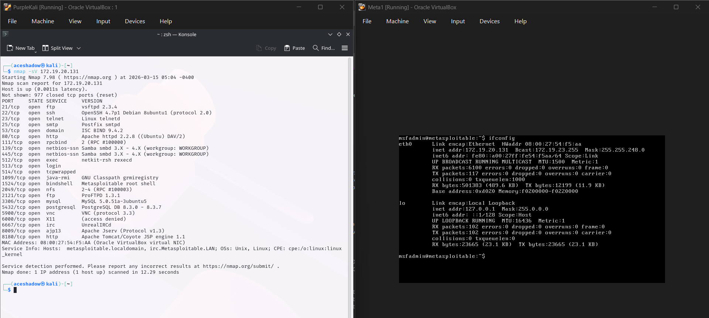
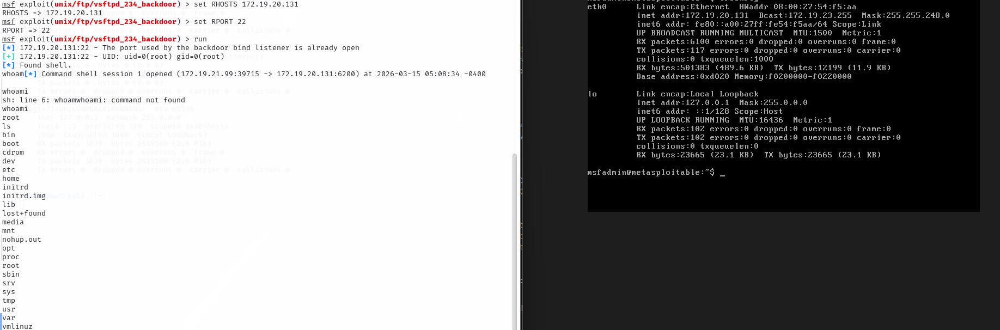
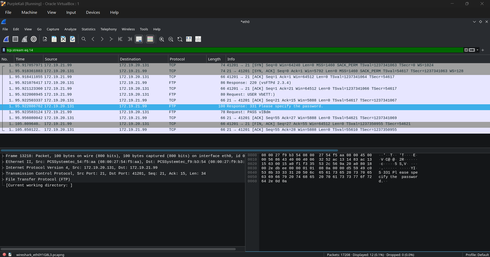
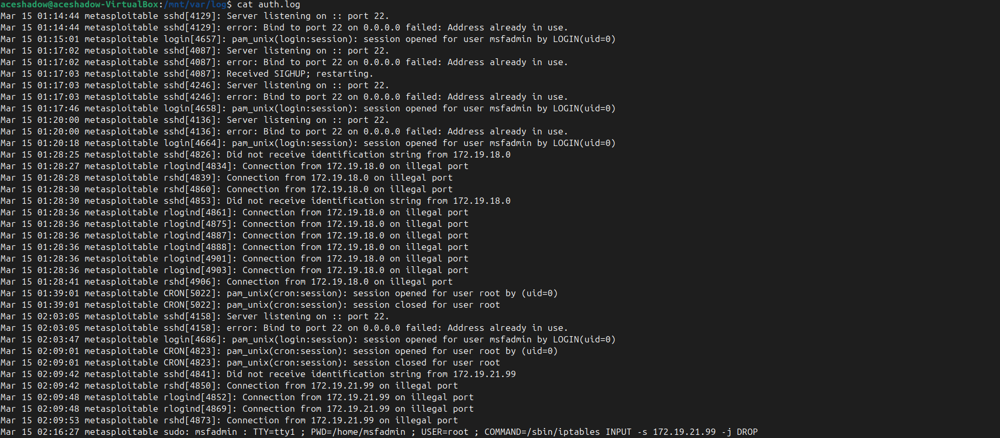

# Cybersecurity Incident Response & Digital Forensics Simulation




---

## Project Overview

This project demonstrates a **simulated cybersecurity incident response and digital forensic investigation** conducted in a controlled virtual lab environment using **Kali Linux** and **Metasploitable**.

The objective of this project is to simulate a cyberattack scenario and analyze it through **network monitoring and system log analysis**, demonstrating the complete **incident response lifecycle**:

* Detection
* Containment
* Eradication
* Recovery
* Digital Forensic Investigation

---

## Lab Environment

| Machine        | Role                       | Operating System |
| -------------- | -------------------------- | ---------------- |
| Kali Linux     | Security Testing Machine   | Kali Linux       |
| Metasploitable | Vulnerable Training Server | Linux            |

**Virtualization Platform:** VirtualBox

---

## Network Architecture


---

## Tools Used

| Tool                 | Purpose                              |
| -------------------- | ------------------------------------ |
| Nmap                 | Network reconnaissance and scanning  |
| Metasploit Framework | Exploitation testing                 |
| Wireshark            | Network packet analysis              |
| Autopsy              | Digital forensic investigation       |
| Ubuntu               | Disk image mounting and log analysis |

---

## Attack Simulation

The attacker machine performed **reconnaissance and exploitation attempts** against the vulnerable Metasploitable server.

### Steps performed during the simulation:

1. Network scanning using **Nmap**
2. Identifying vulnerable services on the target system
3. Exploitation testing using **Metasploit Framework**
4. Monitoring network packets using **Wireshark**
5. Analyzing authentication logs for forensic evidence
6. Blocking attacker IP address using firewall rules

---

## Evidence Screenshots

### Nmap Scan



### Exploit Execution



### Packet Capture



### Authentication Log Evidence



---

## Incident Response Lifecycle

### Detection

Suspicious network activity was detected using **Wireshark packet capture and authentication log analysis**.

### Containment

The attacker IP address was blocked using **firewall rules** to prevent further communication.

### Eradication

Vulnerable services were identified and restricted to reduce the attack surface.

### Recovery

The system was safely shut down and monitored to prevent further compromise.

---

## Digital Forensic Investigation

System authentication logs were analyzed to identify unauthorized connection attempts.

Important log files examined:

```
/var/log/auth.log
/var/log/messages
/var/log/vsftpd.log
```

These logs revealed repeated connection attempts from suspicious IP addresses and confirmed simulated attack activity.

---

## Learning Outcomes

This project helped develop practical experience in:

* Cyberattack simulation
* Network traffic analysis
* Authentication log analysis
* Digital forensic investigation
* Incident response methodology

---

## Full Investigation Report

The complete **Incident Response and Digital Forensics Report** is available in this repository:

`cybersecurity_incident_response_forensics_report.docx`

---

## Author

**Satya Pragy Anand**
B.Tech CSE (Cybersecurity)
SOC Analyst | Incident Responder | Digital Forensics
